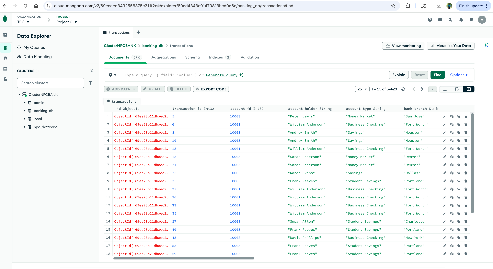
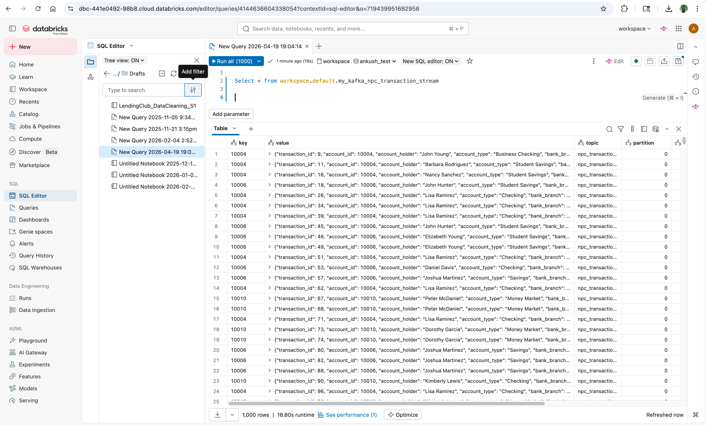

# kafka_npc_transactions
This repo is for Learning Kafka, to setup confluent Kafka cluster , producing data and consume via Mongo DB and Databricks. Results are shown below:

### MongoDB Consumer Output
Below is the data successfully consumed from Kafka and stored in MongoDB:

### Databricks Streaming Output
This screenshot shows the real-time data processing within the Databricks environment:
