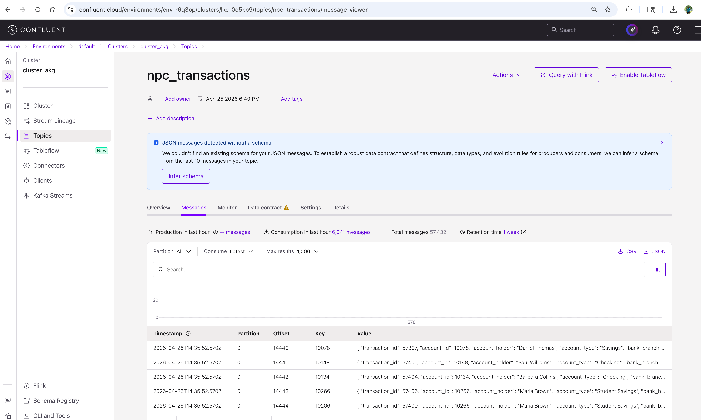

# kafka_npc_transactions
This repo is for Learning Kafka, to setup confluent Kafka cluster , producing data and consume via Mongo DB and Databricks. Results are shown below:

### Python Files
- **databricks_consumer.py**: Consumes Kafka data and writes to Databricks Delta table for real-time processing.
- **generate_banking_data.py**: Generates synthetic banking transaction data for testing purposes.
- **mongodb_consumer.py**: Kafka consumer that reads transactions and stores them in MongoDB.
- **myproducer_bulk_data.py**: Kafka producer that sends bulk banking data from a JSON file to the topic.
- **myproducer_single_row.py**: Kafka producer that sends a single banking transaction to the topic.
- **verify_connections.py**: Verifies connections to Kafka and MongoDB for troubleshooting.

### MongoDB Consumer Output
Below is the data successfully consumed from Kafka and stored in MongoDB:

### Databricks Streaming Output
This screenshot shows the real-time data processing within the Databricks environment:

### Kafka Streaming
This screenshot shows the real-time data processing within the Kafka environment:

